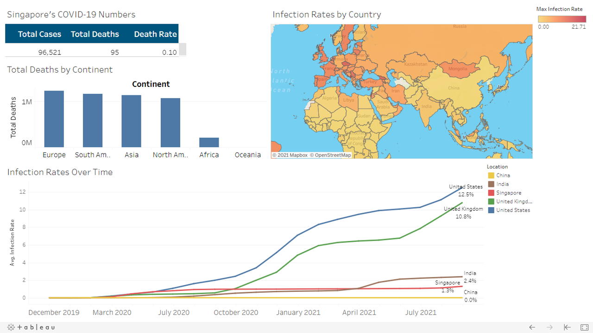

# COVID-19 Data Exploration Project

## Overview

For this project, COVID-19 data from Our World in Data was extracted on 30-09-2021 from https://ourworldindata.org/explorers/coronavirus-data-explorer

The COVID-19 dataset from Our World in Data is an extremely comprehensive dataset containing information about deaths, cases, tests, hospitalizations, vaccinations, mortality risk and excess mortality for all countries in the world. Data is updated on a daily basis and provides an excellent resource to understand the COVID-19 situation for different places around the world, beyond what is seen and heard in the mainstream media.

The data extracted was cleaned using the Python pandas library and separated into 2 tables, namely `covid_deaths` and `covid_vaccinations`. Both tables were subsequently imported into postgreSQL via pgAdmin for data exploration using SQL queries.

Finally, Tableau was used to visualise the key findings into a dashboard. Access the full dashboard on Tableau Public using this link: https://public.tableau.com/views/COVID-19Dashboard_16338670691100/COVID-19Dashboard?:language=en-US&:display_count=n&:origin=viz_share_link

